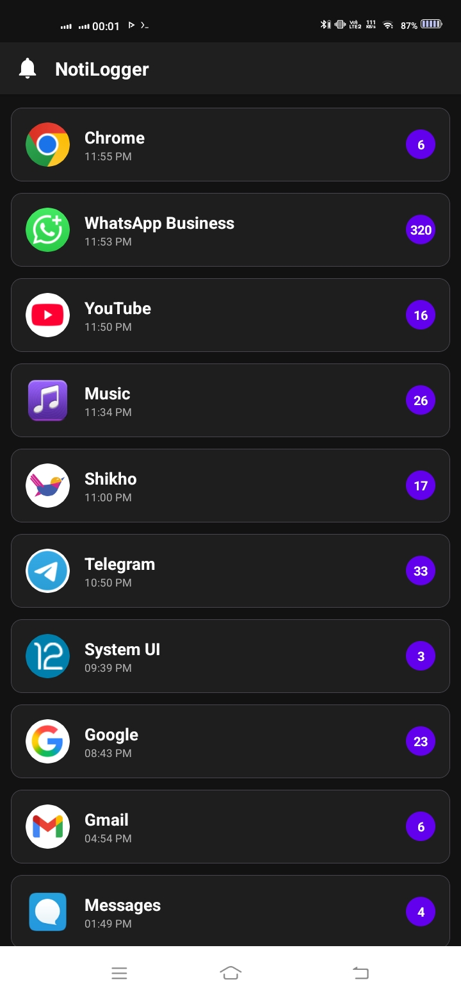
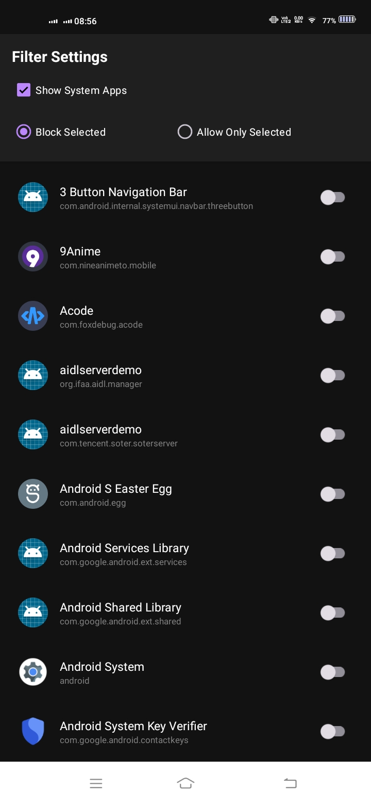
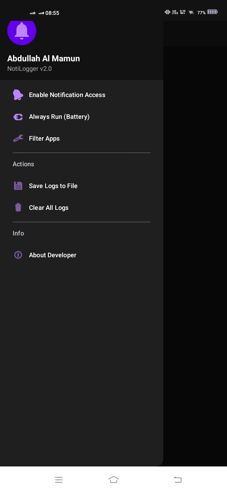

# NotiLogger 📱

**NotiLogger** is a privacy-focused, open-source Android application that allows you to capture, store, and manage your system notifications locally. Never miss a notification again.

---

## ✨ Features

- 📝 **Auto-Logging:** Automatically saves every notification to a local SQLite database.
- 🛡️ **Advanced Filtering:** 
    - **App Filtering:** Whitelist or Blacklist specific apps.
    - **Keyword Filtering:** Block notifications globally or per-app based on custom keywords (e.g., OTP, Promo).
- 🔒 **Security & Privacy:**
    - **Database Encryption:** All logs are secured with AES-256 encryption using **SQLCipher**.
    - **App Lock:** Secure the interface with a PIN or Password, featuring auto-lock timeouts.
    - **Privacy First:** No internet permission required. All data remains strictly on-device.
- 🔍 **Smart Search:** Quickly find notifications by app name, package name, or notification content.
- 📤 **Export & Backup:** Export your logs to a structured `JSON` file for analysis.
- 🎨 **Modern UI:** Built with Material 3 components, featuring a clean Dark Mode interface.

## 📸 Screenshots

| Home Screen | Filter Settings | Notification Details |
| :---: | :---: | :---: |
|  |  |  |

## 🚀 Installation

1. Download the latest APK from the [Releases](https://github.com/mamun10fx/NotiLogger/releases) page.
2. Install the APK on your Android device.
3. **Grant Permission:**
    - Go to `Settings` -> `Apps` -> `Special app access` -> `Notification access`.
    - Enable **NotiLogger**.

## 🛠️ Built With

- **Kotlin** - Primary programming language.
- **Room Persistence** - Local SQLite database management.
- **SQLCipher** - 256-bit AES database encryption.
- **Coroutines & Flow** - Asynchronous programming.
- **Material Components** - UI design system.
- **Gson** - JSON serialization.

## 🤝 Contributing

Contributions are what make the open-source community such an amazing place to learn, inspire, and create. Any contributions you make are **greatly appreciated**.

Please see [CONTRIBUTING.md](CONTRIBUTING.md) for more details.

## 📄 License

Distributed under the MIT License. See `LICENSE` for more information.

## 👤 Author

**Abdullah Al Mamun**
- GitHub: [@mamun10fx](https://github.com/mamun10fx)
- Email: mamun10fx@gmail.com
- Socials: [Facebook](https://www.facebook.com/profile.php?id=61583220766712) | [Telegram](https://t.me/mamun10sc) | [Instagram](https://www.instagram.com/mamun10xc)
